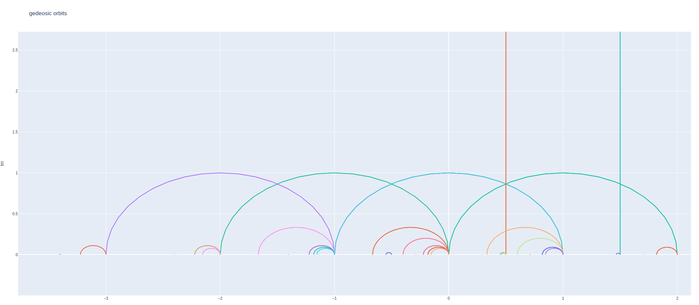
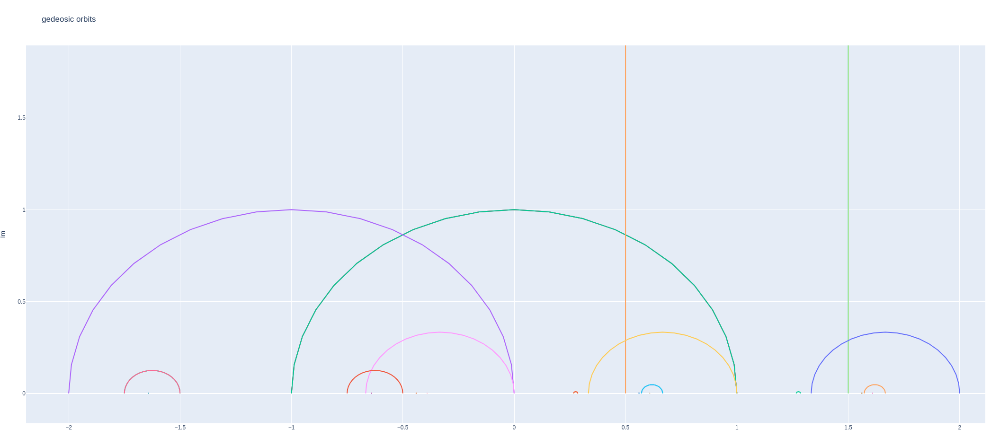
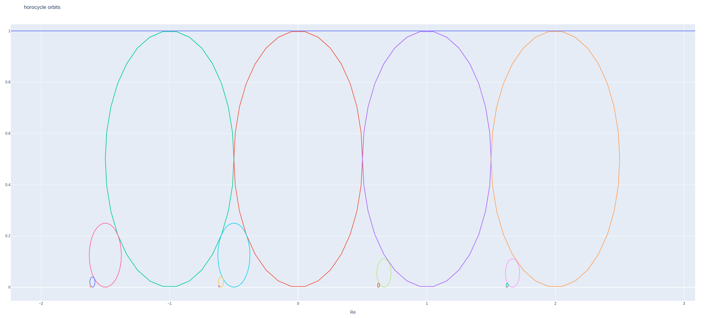

# fuchsian-rs

<b> Fuchsian-rs</b> is a library for visualizing (2-dimensional) <i>hyperbolic geometry</i> and the <i>dynamics</i> of <i>isometry group actions</i>, meaning subgroups of <i>PSL(2, R)</i> acting on the hyperbolic (Poincaré) upper half plane (or disk) via <i>Moebius transformations</i>.
In particular we focus on orbits of finitely generated subgroups of <i>PSL(2, R)</i>, so called <b>Fuchsian groups</b>.

We provide several ways of visualizing orbits of group actions, namey via
- [python api](./python-api/README.md) (see [examples](./python-api/examples))
- Bevy (TODO)
- raw data exports (TODO)

### Sample visualizations

fuchsian orbits of a geodesic (created with the [python-api](./python-api/examples/geodesic_orbit.py))

fuchsian orbit of a horocycle (created with the [python-api](./python-api/examples/horocyclic_orbit.py))

### Related work and background reading

We refer to related work (to our knowledge)
- [Slview](https://github.com/daviddumas/slview)
- [hyperbolic](https://github.com/cduck/hyperbolic)
- ...

For further reading of background
- [F. Dal'bo - Geodesic and Horocyclic Trajectories](https://link.springer.com/book/10.1007/978-0-85729-073-1)
- [M. Einsieder, T. Ward - Ergodic Theory](https://link.springer.com/book/10.1007/978-0-85729-021-2)

### Contribution and vision

Contributions are highly welcome!

Besides many improvements to be done, further possible features and support may go in the direction of
- Diophanintine Approximation, Schmidt games
- Fundamental domains
- Dynamics on different spaces (such as billiards)
